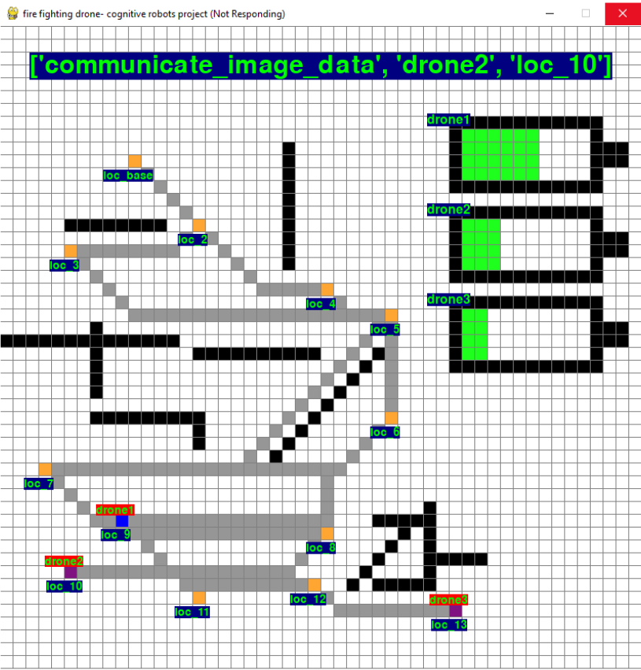

# PDDL_Task_Planning-
Multi-Agent drone Aid System for Firefighters

Multi agent system for optimally solving task under constraints using PDDL planning tool

Each agent(drone) gets a goal location it should reach to check if there is a fire
the drone is limited in battery and should land after some distance to for reacharging.
some areas are blocked, the agents plan path using A* algorithm.
when agent reach a goal, it should take picure of it, raise antenna and transmit the data before continuing to the next goal

problem example of 3 drones:

